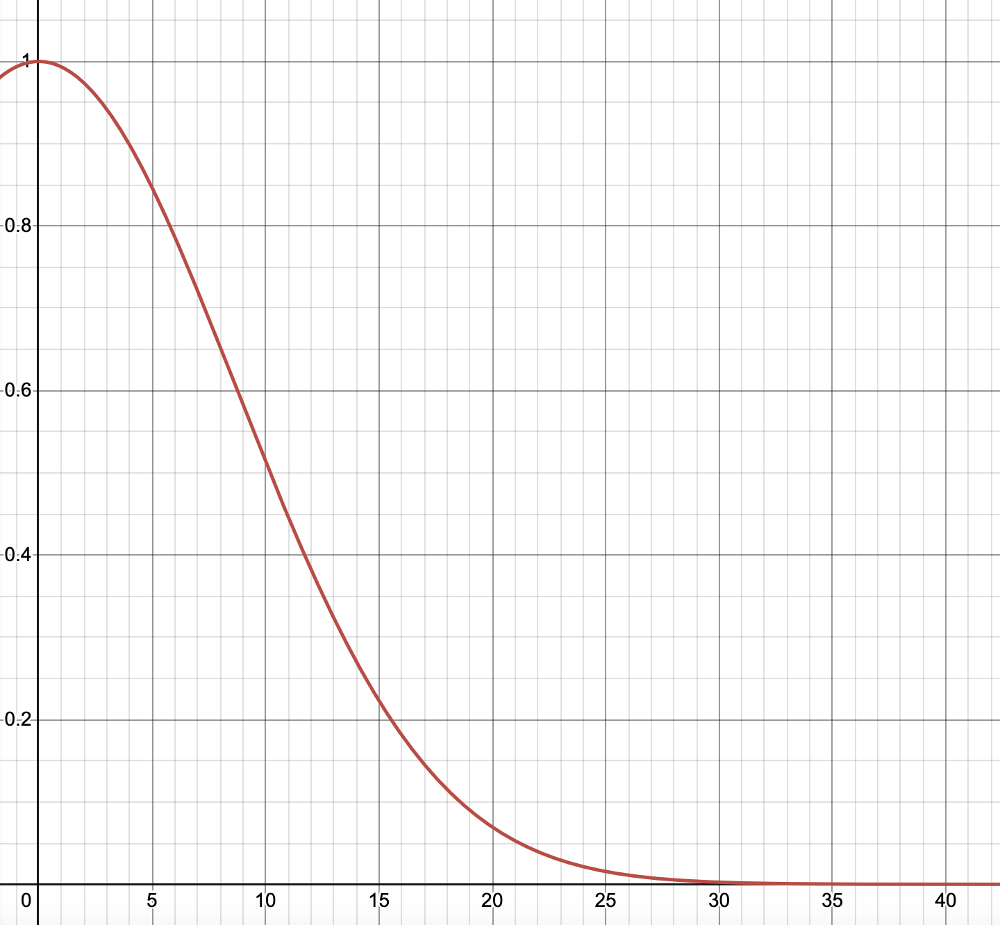
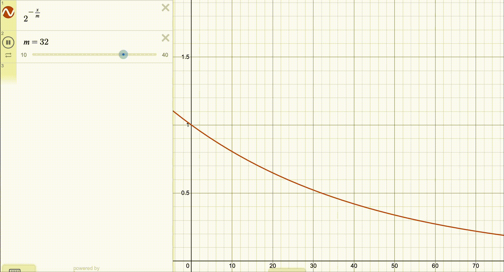

## Ranking attributes
### Age attribute
Radial basis functions (RBF) can be used. The age difference is weighted with the formula:
$$w(\text{age}_x, \text{age}_y)=e^{-\frac{(\text{age}_x-\text{age}_y)^2}{150}}$$
On the x-axis we have the age difference, and on the y-axis we have the weight.
<!-- import image from file -->

### Price attribute
Here it is necessary to penalize prices that are higher than the average price. A possible formula can be:
$$w(\text{price})=\frac{1}{k}e^{-\frac{\text{price}-\mu}{\sigma}}$$
where $\mu$ is the average price. By imposing the constraint to have a score of $1$ when the price is zero, we obtain:
$$w(\text{price})=\left(\frac{1}{k}\right)^\frac{\text{price}}{\mu}$$
By imposing to have a score of $0.5$ when the price is the average price ($k=2$), we obtain:
$$w(\text{price})=2^{-\frac{\text{price}}{\mu}}$$

### Education attribute
Some hard-coded scores can be used here, e.g.:
```[json]
{
    'elementary': 0, 
    'high-school': 0.2, 
    'bachelor': 0.5, 
    'master': 0.9, 
    'phd': 1
}
```
We use the difference between the education levels of the user and the guide. The formula can be:
$$w(\text{education}_x, \text{education}_y)=\max(0, \text{education}_y + (\text{education}_x - \text{education}_y))$$
### Location attribute
The distance between two locations can be used. The formula can be:
$$w(\text{location}_x, \text{location}_y)=\frac{1}{1+\text{distance}(\text{location}_x, \text{location}_y)}$$

### Keywords attribute
The Jaccard similarity can be used. The formula can be:
$$w(\text{keywords}_x, \text{keywords}_y)=\frac{|\text{keywords}_x \cap \text{keywords}_y|}{|\text{keywords}_x \cup \text{keywords}_y|}$$

### Query
```
GET /guides/_search
{
  "query": {
    "function_score": {
      "query": {
        "bool": {
          "must": [
            {
              "terms": {
                "languages_spoken": [
                  "bulgarian"
                ]
              }
            },
            {
              "term": {
                "now_available": true
              }
            }
          ]
        }
      },
      "script_score": {
        "script": {
          "source": 
          """
          // Age scorer
          def target_age = params.target_age;
          Instant instant = Instant.ofEpochMilli(new Date().getTime());
          ZonedDateTime birth = doc['birth_date'].value;
          ZonedDateTime now = ZonedDateTime.ofInstant(instant, ZoneId.of('Z'));
          def doc_age = ChronoUnit.YEARS.between(birth, now);
          def age_score = Math.exp(-Math.pow(target_age - doc_age, 2)/150);
          
          // Price scorer
          def price_score = Math.pow(2, -doc['price'].value/params.avg_price);
          
          // Education scorer
          def user_education = params.user_education;
          def education_scores_map = [
            "elementary": 0,
            "high-school": 0.2,
            "bachelor": 0.5,
            "master": 0.9,
            "phd": 1
          ];
          
          def guide_education = doc['education'].value;
          def education_score = education_scores_map[guide_education];
    
          // Calculate the difference in education levels
          def education_diff = education_scores_map[user_education] - education_score;
          def adjusted_education_score = Math.max(0, education_score + education_diff);
    
          

          // Distance scorer
          double target_lat = params.target_lat;
          double target_lon = params.target_lon;

          double targetLatRad = Math.toRadians(target_lat);
          double targetLonRad = Math.toRadians(target_lon);
          
          // Get the document's latitude and longitude from the geo-point field
          double docLat = doc['current_location'].lat;
          double docLon = doc['current_location'].lon;
          
          // Convert document's latitude and longitude to radians
          double docLatRad = Math.toRadians(docLat);
          double docLonRad = Math.toRadians(docLon);
          
          // Earth's radius in kilometers
          double earthRadius = 6371.0; // Approximate radius of the Earth in kilometers

          double dLat = docLatRad - targetLatRad;
          double dLon = docLonRad - targetLonRad;
          
          // Haversine formula
          double a = Math.sin(dLat / 2.0) * Math.sin(dLat / 2.0) +
                     Math.cos(targetLatRad) * Math.cos(docLatRad) *
                     Math.sin(dLon / 2.0) * Math.sin(dLon / 2.0);
          double c = 2.0 * Math.atan2(Math.sqrt(a), Math.sqrt(1.0 - a));
          
          // Calculate the distance
          double distance = earthRadius * c;
          
          double distance_score = 1 / (1 + distance);
          
          
          // Keywords scorer
          // Jaccard similarity
          // Define two arrays from params
          List array1 = params.keywords;
          List array2 = doc['keywords'];
          
          // Calculate the intersection size
          Set set1 = new HashSet();
          Set set2 = new HashSet();
          
          // Add elements from array1 to set1
          for (String element : array1) {
              set1.add(element);
          }
          
          // Add elements from array2 to set2
          for (String element : array2) {
              set2.add(element);
          }
          
          // Calculate the intersection size
          Set intersectionSet = new HashSet(set1);
          intersectionSet.retainAll(set2); // Intersection
          int intersectionSize = intersectionSet.size();
          
          // Calculate the union size
          Set unionSet = new HashSet(set1);
          unionSet.addAll(set2); // Union
          int unionSize = unionSet.size();
          
          // Calculate Jaccard similarity (intersection over union)
          double keyword_score = intersectionSize / (double) unionSize;
          
          return
            0.1 * age_score
            + 0.3 * price_score
            + 0.1 * education_score
            + 0.3 * distance_score
            + 0.005 * keyword_score
            ;
          """,
          "params": {
            "target_age": 17,
            "avg_price": 31,
            "target_lat": 41.462,
            "target_lon": 18.161,
            "keywords": ["wine", "museums"],
            "user_education": "phd"
          }
        }
      }
    }
  } 
}
```
